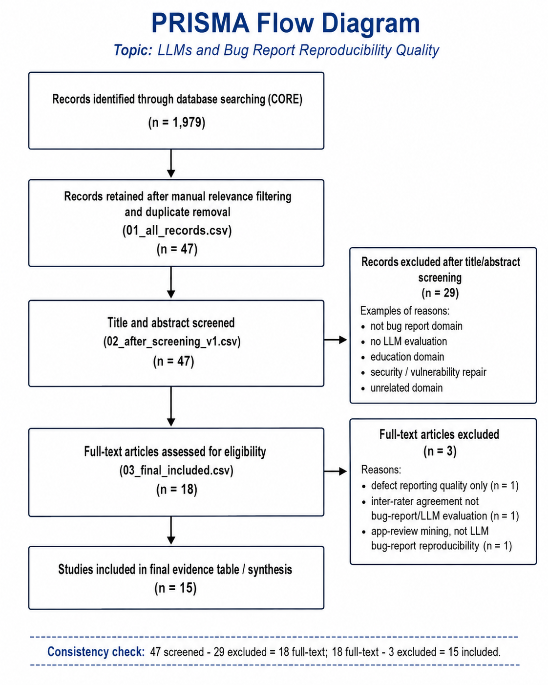

# PRISMA Flow

## Search source

Database: CORE  
Search strings: String A, String B, String C, String D

## PRISMA counts

| Stage | Count | Source file / note |
|---|---:|---|
| Records identified through database searching | 1979 | Search-log raw results: 55 + 1137 + 78 + 709 |
| Records retained after manual relevance filtering and duplicate removal | 47 | `01_all_records.csv` |
| Records screened by title and abstract | 47 | `02_after_screening_v1.csv` |
| Records excluded after title/abstract screening | 29 | `v1_decision = EXCLUDE` |
| Full-text papers assessed for eligibility | 18 | INCLUDE + INCLUDE-BG + UNSURE from V1 |
| Full-text papers excluded | 3 | `v2_decision = EXCLUDE` |
| Studies included in final evidence table / synthesis | 15 | `v2_decision = INCLUDE` |

## Consistency check

- 47 screened - 29 excluded = 18 full-text assessed.
- 18 full-text assessed - 3 full-text excluded = 15 included studies.
- These counts match `01_all_records.csv`, `02_after_screening_v1.csv`, `03_final_included.csv`, and `evidence-table.md`.

## Diagram

